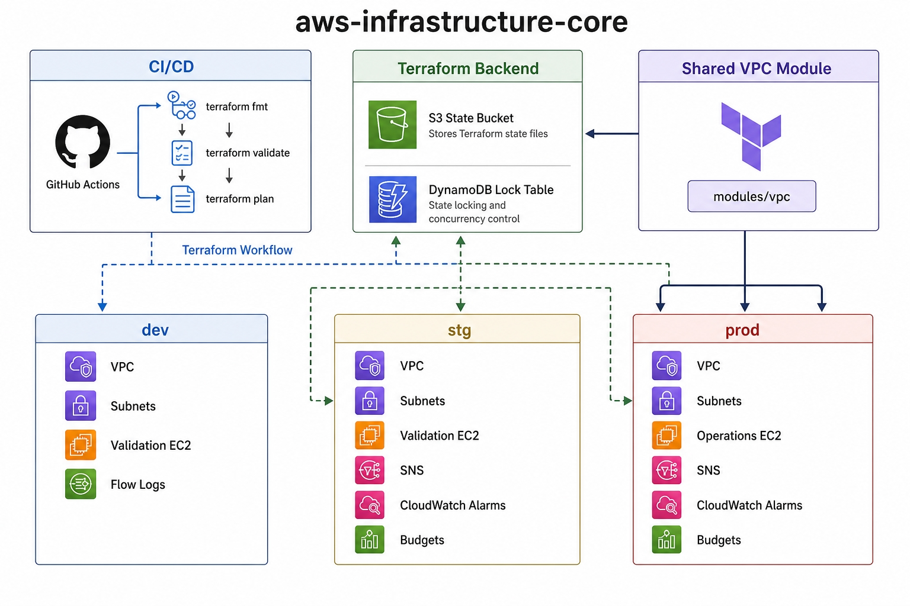

# aws-infrastructure-core

Terraform configuration for a small AWS infrastructure baseline with separate `dev`, `stg`, and `prod` environments.

This repository is focused on infrastructure code rather than application code.
It includes remote state setup, a reusable VPC module, environment-specific root modules, and operational controls such as monitoring and budget alerts.

---

## Architecture

Each environment (`dev`, `stg`, `prod`) is its own root module with its own state. Terraform state lives remotely in S3 with DynamoDB locking, and the shared VPC module is reused across all three.



---

## What This Repository Covers

This repository manages the following AWS infrastructure components:

- Terraform remote state backend
  - S3 bucket (SSE-KMS encrypted, versioned, public access blocked, `prevent_destroy`)
  - DynamoDB table for state locking
  - KMS key for state encryption
- VPC and networking
  - Public/private subnets
  - Route tables
  - Internet gateway
  - NAT gateway
  - Interface VPC endpoints for SSM (optional; used by dev to reach SSM without NAT)
- VPC Flow Logs (optionally encrypted with a dedicated KMS key; enabled in prod)
- EC2 instances for validation and operations access (private subnets, IMDSv2, encrypted EBS, HTTPS-only egress)
- IAM roles and instance profiles for SSM access
- SNS topics and subscriptions
- CloudWatch alarms
- AWS Budgets notifications

---

## Repository Structure

```text
.
├── bootstrap/
│   └── backend/
├── environments/
│   ├── dev/
│   ├── stg/
│   └── prod/
├── modules/
│   └── vpc/
├── docs/
│   └── adr/
├── diagrams/
└── .github/
    └── workflows/
```

- `bootstrap/backend` — Creates the shared Terraform backend resources used by the environment stacks.
- `environments/dev` — Lower-cost development environment for basic validation and iteration.
- `environments/stg` — Staging environment with additional monitoring and budget alerting.
- `environments/prod` — Production-oriented configuration with more conservative defaults. It is primarily maintained as code and does not need to run continuously.
- `modules/vpc` — Reusable VPC module shared across environments.

---

## Environment Approach

Each environment is managed as a separate root module. This keeps state files separate, plans easier to review, environment-specific changes easier to reason about, and risk lower than managing everything from one root module.

| Environment | Purpose | Notes |
|---|---|---|
| `dev` | Development and basic testing | Simpler and lower-cost |
| `stg` | Pre-production validation | Includes monitoring and budget alerts |
| `prod` | Production-oriented configuration | Not deployed continuously |

---

## Remote State

Terraform state is stored remotely in AWS. S3 is used for state storage and DynamoDB is used for state locking.

The backend resources are created first from `bootstrap/backend`, and each environment is then configured to use that backend. This avoids keeping state locally and makes the environment structure easier to manage.

---

## CI

GitHub Actions is used for Terraform checks. Current checks include `terraform fmt`, `terraform validate`, and `terraform plan`. The plan workflow is configured so pull requests can show infrastructure changes before merge.

---

## Security and Operational Choices

This repository includes a small set of controls kept consistent across environments:

- Remote state encrypted with a customer-managed KMS key (SSE-KMS)
- State bucket protected with `prevent_destroy` and public access blocked
- State locking via DynamoDB
- VPC Flow Logs, optionally encrypted with a dedicated KMS key (enabled in prod)
- SSM-based instance access instead of SSH, with instances in private subnets
- SSM reachability for dev via interface VPC endpoints (no NAT)
- Instance security groups restricted to outbound HTTPS (443) only
- IMDSv2 enabled on EC2 instances
- Encrypted EBS root volumes
- Account guardrails with `allowed_account_ids`
- CloudWatch alarms and SNS notifications where appropriate
- AWS Budgets notifications for cost visibility

---

## How to Use

### 1. Create the backend

```bash
cd bootstrap/backend
cp terraform.tfvars.example terraform.tfvars
terraform init
terraform plan -out=tfplan
terraform apply tfplan
```

After apply, note the backend outputs and use them in each environment's local `backend.hcl`.

### 2. Work with an environment

Example for `stg`:

```bash
cd environments/stg
cp backend.hcl.example backend.hcl
cp terraform.tfvars.example terraform.tfvars
terraform init -backend-config=backend.hcl -reconfigure
terraform plan -var-file=terraform.tfvars
```

---

## Local Files

These files are intended for local use and should not be committed:

- `backend.hcl`
- `terraform.tfvars` when it contains local or account-specific values

Example files are included instead:

- `backend.hcl.example`
- `terraform.tfvars.example`

---

## Notes on Cost

This repository keeps the scope practical and the running cost low, so not every environment needs to be deployed continuously. A few choices were made with cost in mind:

- `dev` stays relatively small
- `prod` can be kept as code without permanent deployment
- Backend resources are low-cost compared with full environment deployments
- Monitoring and budget alerts are included as part of the environment setup

---

## Why It Is Structured This Way

Separate environment roots were chosen instead of a single Terraform root because it makes the workflow easier to follow: backend setup is independent, each environment has a clear scope, plans are easier to read, and changes are easier to review in pull requests.

This is not the only valid way to structure Terraform, but it is a practical layout for a small multi-environment repository.

---

## Future Improvements

Areas to extend next:

- Stronger multi-account separation
- Policy-as-code checks (e.g. Trivy) — planned; currently covered by fmt/validate/plan in CI
- Additional automated testing
- More module-level documentation
- Environment-specific diagrams
